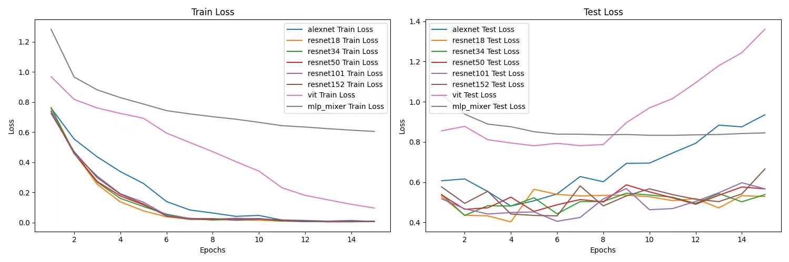
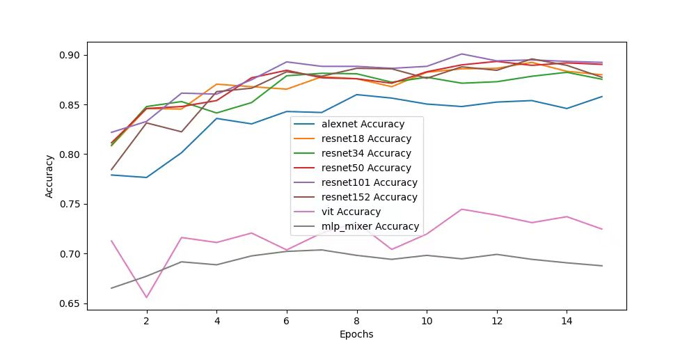

# HAM_10000-Classification-with-CNNs-in-PyTorch
Here is the paper of ths project titled "Image Classification of Skin Cancer Using Deep Neural Networks with Scaling Laws", published in the journal International Journal of Computer Science and Information Technology (ISSN: 3005-9682 eISSN: 3005-7140, DOI: https://doi.org/10.62051/ijcsit.v3n2.12) under the paper ID IJCSIT-6335.

## Problem Statement
Skin cancer is a major global health issue, with early detection being critical to improving treatment outcomes. However, the current manual process of diagnosing skin cancer through dermoscopy, while useful, is time-consuming, subjective, and limited by the availability of skilled dermatologists. Automated image classification methods using deep learning models have shown promise in enhancing diagnostic accuracy and efficiency, but the relationship between dataset size and model performance remains unclear. Specifically, it is unknown how different neural network architectures perform when trained on varying amounts of data, particularly in real-world scenarios where datasets may be limited or region-specific.

## Project Aim
This project aims to investigate how the size of the dataset and the complexity of neural network models influence the accuracy of skin cancer image classification. By understanding the interplay between dataset scale and model architecture, the project seeks to offer healthcare professionals better automated tools for skin cancer detection, potentially alleviating the burden on dermatologists and improving patient outcomes.

## Technologies and Tools
- **Dataset**: HAM10000
- **Programming Language**: Python 3.8
- **Deep Learning Frameworks**:
  - PyTorch:
    - torchaudio-2.1.2+cu121-cp38
    - torch-2.1.2+cu121-cp38
    - torchvision-0.16.2+cu121-cp38
- **Models**: 
  - AlexNet
  - ResNet (18, 34, 50, 101, 152)
  - ViT (Base)
  - MLP-Mixer (B/16)

## Conclusion

This study investigated the performance of eight deep neural networks in skin cancer image classification. The results on the HAM10000 dataset demonstrated that, the complex interplay between data size, model complexity, and computational costs, validated the effectiveness of neural scaling laws in this problem. The models were trained on datasets ranging from 1% to 100%, with the highest average accuracy of 85.09% when the dataset size was 5% (1002 images). Notably, ResNet101 trained with 100% dataset and ResNet152 trained with 5% dataset obtained the highest accuracy of 90.07% and 90.02% respectively. Our experimental results suggest that the dataset size and model complexity both significantly affect performance. For example, ResNet101 and ResNet152 achieved higher accuracy on larger datasets. In contrast, AlexNet, ViT, and MLP-Mixer performed best on smaller datasets. By understanding the impact of dataset size and model complexity, researchers can develop more efficient and accurate skin cancer classification methods. Overall, this study promotes advances in skin cancer classification methods that have the potential to improve healthcare outcomes and reduce the burden on healthcare professionals. 

## References
1. Codella, N., Rotemberg, V., Tschandl, P., et al. "Skin Lesion Analysis Toward Melanoma Detection 2018: A Challenge Hosted by the International Skin Imaging Collaboration (ISIC)", 2018. [arXiv](https://arxiv.org/abs/1902.03368)
2. Tschandl, P., Rosendahl, C., & Kittler, H. "The HAM10000 dataset, a large collection of multi-source dermatoscopic images of common pigmented skin lesions". Sci. Data 5, 180161. [DOI](https://doi.org/10.1038/sdata.2018.161) (2018).
