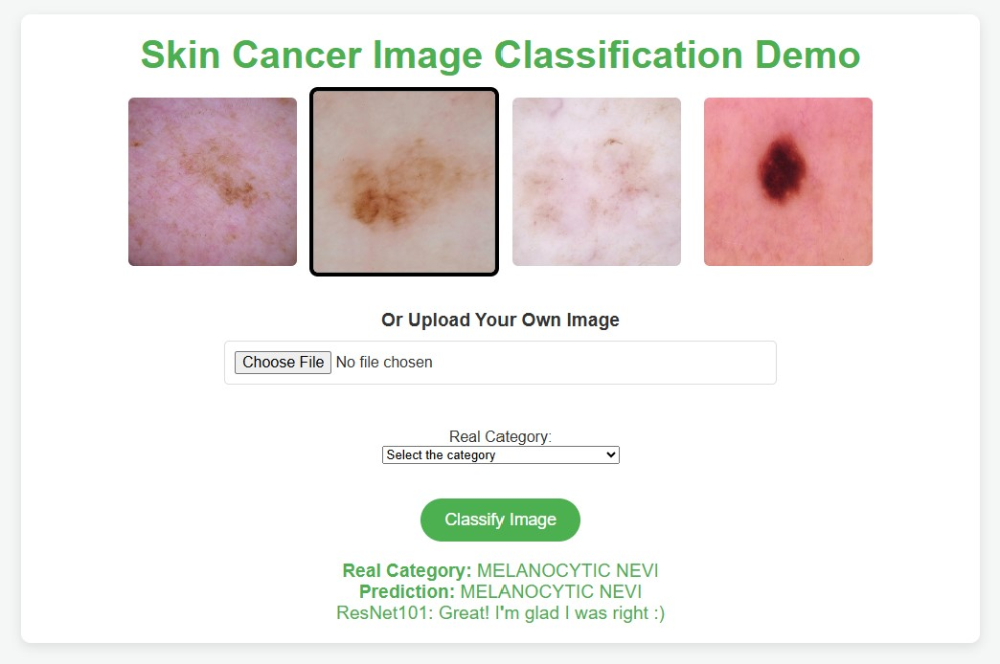
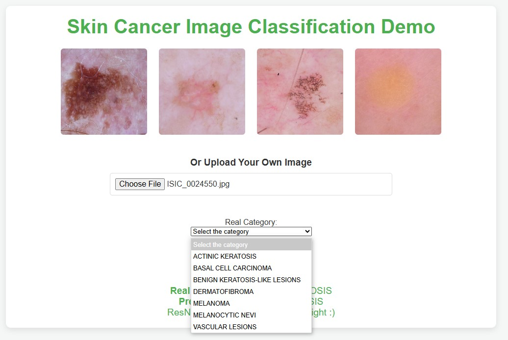

# HAM_10000-Classification-with-CNNs-in-PyTorch
Here is the paper of this project titled "Image Classification of Skin Cancer Using Deep Neural Networks with Scaling Laws", published in the journal International Journal of Computer Science and Information Technology (ISSN: 3005-9682 eISSN: 3005-7140, DOI: https://doi.org/10.62051/ijcsit.v3n2.12) under the paper ID IJCSIT-6335.

## You can run demo.py to interact with the trained model :)

## Problem Statement
Skin cancer remains a substantial public health issue worldwide, with early detection being essential to improve patient outcomes. The existing manual approach of diagnosing skin cancer via dermoscopy, although beneficial, is often time-consuming, subjective, and reliant on the availability of qualified dermatologists. Deep learning-based automated image classification methods have demonstrated potential in improving diagnostic accuracy and efficiency. Yet, the relationship between dataset size and model performance is not well-understood. Specifically, there is limited insight into how neural network architectures perform across varying dataset sizes, especially in real-world scenarios where datasets are often limited or region-specific.

## Project Aim
This project seeks to analyze how dataset size and neural network complexity impact the accuracy of skin cancer image classification. By examining the relationship between dataset scale and model architecture, the project aims to offer healthcare providers more effective automated tools for skin cancer detection, potentially easing the workload of dermatologists and enhancing patient outcomes.

## Technologies and Tools
- **Dataset**: HAM10000 [1][2]
- **Programming Language**: Python 3.8
- **Deep Learning Frameworks**:
  - PyTorch:
    - torchaudio-2.1.2+cu121-cp38
    - torch-2.1.2+cu121-cp38
    - torchvision-0.16.2+cu121-cp38
- **Models**: 
  - AlexNet
  - ResNet (18, 34, 50, 101, 152)
  - ViT (Base)
  - MLP-Mixer (B/16)
 
## Conclusion

This study evaluated the performance of eight deep neural networks in skin cancer image classification using the HAM10000 dataset. Results highlighted the complex interaction among data size, model complexity, and computational requirements, substantiating the relevance of neural scaling laws to this domain. Models were trained on dataset subsets ranging from 1% to 100%, with the highest average accuracy, 85.09%, achieved using a 5% dataset (1,002 images). Notably, ResNet101 trained on the full dataset (100%) and ResNet152 trained on a 5% subset achieved top accuracies of 90.07% and 90.02%, respectively. The findings suggest that both dataset size and model complexity substantially influence classification performance. For instance, ResNet101 and ResNet152 achieved higher accuracy with larger datasets, while AlexNet, ViT, and MLP-Mixer performed optimally on smaller datasets. This understanding of dataset size and model complexity implications can guide researchers in developing more efficient and accurate methods for skin cancer classification, ultimately supporting advances that could improve patient care and alleviate demands on healthcare professionals.

## References
[1]: Codella, N., Rotemberg, V., Tschandl, P., et al. "Skin Lesion Analysis Toward Melanoma Detection 2018: A Challenge Hosted by the International Skin Imaging Collaboration (ISIC)", 2018. [arXiv](https://arxiv.org/abs/1902.03368)

[2]: Tschandl, P., Rosendahl, C., & Kittler, H. "The HAM10000 dataset, a large collection of multi-source dermatoscopic images of common pigmented skin lesions". Sci. Data 5, 180161. [DOI](https://doi.org/10.1038/sdata.2018.161) (2018).
